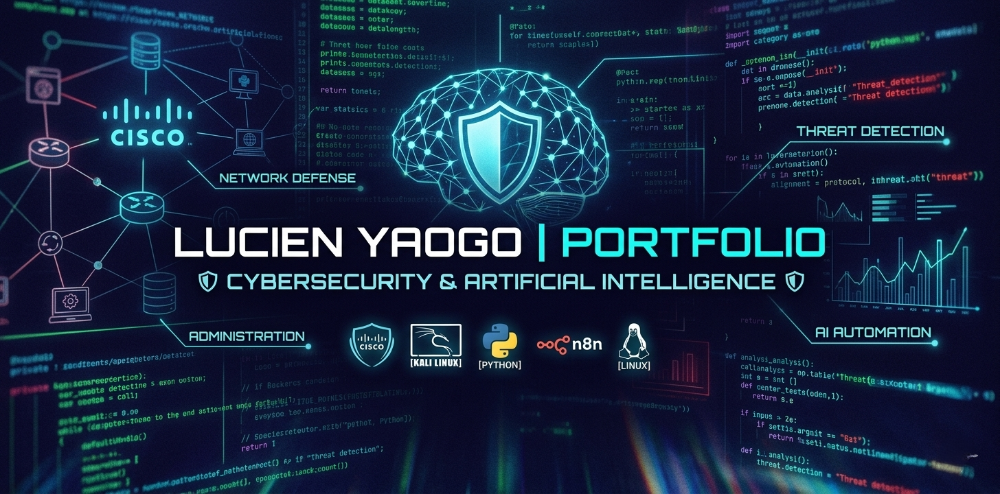

# Hi, I'm Lucien YAOGO 👋

### 🛡️ Cybersecurity Student & IT Infrastructure Specialist
Passionné par la convergence entre l'**Intelligence Artificielle** et la **Sécurité Informatique**, je me spécialise dans l'automatisation de la détection de menaces et l'administration de réseaux sécurisés.

---

### 🚀 Technical Skills

**Network & Security**

**AI & Automation**

**Systems**

---

### 📺 Content Creation
Je partage mes connaissances sur les réseaux et l'administration système sur ma **chaîne YouTube dédiée à la formation Cisco CCNA**.

---

### 📫 Connect with me

